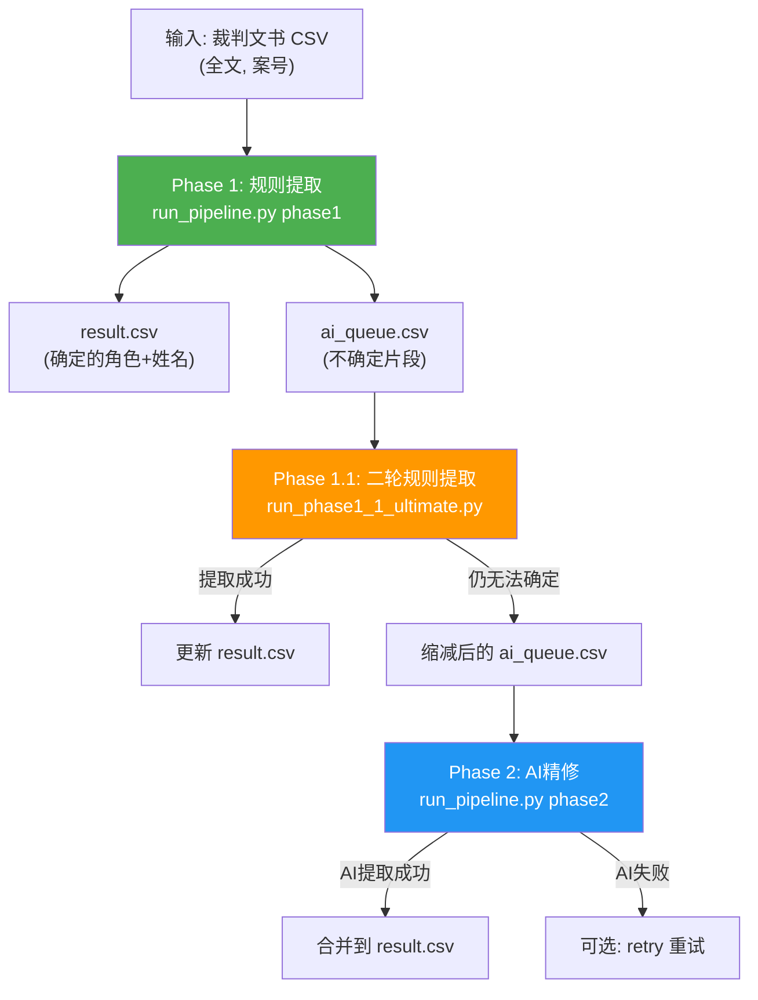

# 裁判文书角色提取系统 — 完整流程文档

## 一、项目概述

本系统用于从中国裁判文书全文中**自动提取审判相关角色及其姓名**，包括：审判长、审判员、代理审判长、代理审判员、书记员、代理书记员、助理审判员。

系统采用**三阶段流水线**设计，逐步提高提取覆盖率和准确率：

| 阶段 | 名称 | 方法 | 入口脚本 |
|------|------|------|----------|
| Phase 1 | 规则提取 | 全文扫描 + 边界判断 + 增强规则 | `src/run_pipeline.py phase1` |
| Phase 1.1 | 二轮规则提取 | 向量化正则 + 姓氏截断 + AC自动机 | `run_phase1_1_ultimate.py` |
| Phase 2 | AI 精修 | GLM-4 大模型批量提取 | `src/run_pipeline.py phase2` |

---

## 二、项目结构

```
Referee-documents/
├── src/                         # 核心源码
│   ├── run_pipeline.py          # 主入口：Phase 1 / Phase 2 / retry / status
│   ├── run_phase3.py            # Phase 3: AI失败结果补漏（可选）
│   ├── core/                    # 核心模块
│   │   ├── __init__.py          # 模块导出
│   │   ├── config.py            # 配置管理器
│   │   ├── rule_extractor.py    # 规则提取器（全文扫描 + 边界判断）
│   │   ├── enhanced_rule_extractor.py  # 增强规则提取器（减少AI调用）
│   │   ├── glm4_extractor.py    # GLM-4 AI提取器
│   │   └── utils.py             # 工具函数（宽表输出、CSV写入）
│   └── models/                  # 数据模型
│       ├── __init__.py
│       └── person.py            # Person 数据类
├── run_phase1_1_ultimate.py     # Phase 1.1：二轮规则提取（终极版）
├── config/                      # 配置文件
│   ├── config.json              # API + 处理参数配置
│   ├── roles.json               # 角色定义和优先级
│   └── .env.example             # API密钥模板
├── data/output/                 # 输出目录（gitignore）
├── input/                       # 输入CSV数据（gitignore）
├── requirements.txt             # Python 依赖
├── README.md                    # 项目说明
└── PIPELINE.md                  # 本文档
```

---

## 三、完整执行流程

### 运行命令总览

```bash
# 第一步：Phase 1 — 规则提取
python src/run_pipeline.py phase1 --input input/2016年01月裁判文书数据.csv --output-dir data/output

# 第二步：Phase 1.1 — 二轮规则提取（处理 Phase 1 的 AI 队列）
python run_phase1_1_ultimate.py

# 第三步：Phase 2 — AI 精修（处理剩余不确定片段）
python src/run_pipeline.py phase2 --output-dir data/output

# 可选：查看处理状态
python src/run_pipeline.py status --output-dir data/output

# 可选：重试 Phase 2 中失败的片段
python src/run_pipeline.py retry --output-dir data/output
```

### 流程图



---

## 四、各阶段核心逻辑

### Phase 1: 规则提取（`src/run_pipeline.py phase1`）

**功能**：对原始 CSV 全文进行初步扫描，用规则提取确定的角色姓名，将不确定的放入 AI 队列。

**核心流程**：
1. **分块读取**原始 CSV（每块 5000 行，配置可调）
2. 对每行全文调用 `RuleExtractor.extract_fulltext(full_text)`
3. 返回两类结果：
   - **确定列表** `certain: List[Person]` — 直接写入 `result.csv`
   - **不确定列表** `uncertain: List[UncertainSnippet]` — 先经增强规则处理
4. 不确定片段经 `EnhancedRuleExtractor.try_extract()` 再次尝试：
   - 提取成功 → 加入确定列表
   - 确定无姓名 → 丢弃
   - 仍不确定 → 写入 `ai_queue.csv`

**核心算法（`RuleExtractor.extract_fulltext`）**：
- **角色词扫描**：在全文中查找所有角色关键词出现的位置
- **姓名提取**：在角色词后方提取候选姓名（中文字符序列）
- **边界判断**：名字后面是否跟着标点、空白或文末
  - 边界清晰 → 确定
  - 边界模糊 → 不确定（进入 AI 队列）
- **黑名单过滤**：排除"本院"、"法院"、"人民"等常见非人名词
- **姓氏验证**：检查候选姓名首字是否在百家姓字典中

**增强规则（`EnhancedRuleExtractor`）**：
- 基于置信度评分的多策略提取
- 支持去除噪音后缀、处理少数民族姓名（含 `·`）
- 高置信度直接确认，低置信度送 AI

**输出文件**：
| 文件 | 说明 |
|------|------|
| `{文件名}_result.csv` | 宽表格式，每角色一列 |
| `{文件名}_ai_queue.csv` | 不确定片段队列，含角色、片段、状态 |

---

### Phase 1.1: 二轮规则提取（`run_phase1_1_ultimate.py`）

**功能**：对 Phase 1 产生的 `ai_queue.csv` 进行更深层的规则提取，大幅减少需要调用 AI 的片段数量。

**六步处理**：

| 步骤 | 名称 | 方法 |
|------|------|------|
| 1 | 预清洗 | 去除括号内容、脱敏符号（ＸＸＸ、???） |
| 2 | 多模式向量化提取 | 4 种正则模式按优先级匹配 |
| 3 | 姓氏正向截断清洗 | STOP_CHARS 熔断 + 高危姓氏过滤 |
| 4 | AC 自动机双向扫描 | 对第 2 步未匹配的做兜底扫描 |
| 4.5 | 全局二次清洗 | 对全量已提取数据重新应用严格清洗 |
| 5 | 批量更新 | 回写 `result.csv` 和 `ai_queue.csv` |
| 6 | Flag 同步清理 | 确保 result/queue 的状态一致 |

**步骤 2 的四种正则模式**（优先级从高到低）：

```
模式A: "某某某担任审判长"           → 提取"某某某"
模式B: "由审判长某某某担任"         → 提取"某某某"
模式C: "审判长 张 三"（含空格）     → 提取"张三"
模式D: "审判长某某某"（标准格式）   → 提取"某某某"
```

**步骤 3 姓氏正向截断法**：
- **STOP_CHARS 熔断**：遇到"法"、"条"、"律"等字符立即截断（如 `关法律` → `关` → 丢弃）
- **高危姓氏过滤**：`年`、`月`、`日` 等开头的要额外验证
- **严格长度控制**：单姓最多 3 字，复姓最多 4 字
- **百家姓验证**：首字必须在姓氏字典中

**步骤 4 AC 自动机扫描**：
- 用 ahocorasick 库构建包含所有姓氏的自动机
- 在片段中扫描距离角色词最近（< 10 字符）的姓氏
- 取姓氏后 2-3 个字作为候选姓名
- 经过铁血版清洗验证后写入

**最终效果**：Phase 1.1 可提取约 85% 以上的不确定片段，大幅节省 AI 调用成本。

---

### Phase 2: AI 精修（`src/run_pipeline.py phase2`）

**功能**：对 Phase 1.1 之后仍剩余的不确定片段，调用 GLM-4 大模型进行批量提取。

**核心流程**：
1. 读取 `ai_queue.csv` 中状态为"待处理"的片段
2. 将片段打包发送给 `GLM4Extractor`
3. AI 返回 JSON 数组结果
4. 将 AI 提取的姓名合并回 `result.csv`

**AI 提取器（`GLM4Extractor`）**：
- **批量处理**：每次请求最多 500 条片段
- **并发控制**：可配置并发数（默认 10）
- **Prompt 设计**：提供角色+片段，要求返回 JSON 数组 `[{id, name}]`
- **解析容错**：自动处理 JSON 格式异常和部分返回
- **日志记录**：记录每次请求的原始响应

**API 配置**（`config/config.json`）：
```json
{
  "api": {
    "base_url": "https://open.bigmodel.cn/api/paas/v4",
    "model": "glm-4-flash",
    "timeout": 30,
    "max_retries": 3,
    "concurrency": 10
  }
}
```

**结果合并逻辑（`_merge_ai_results`）**：
- 按行号将 AI 提取的姓名追加到 `result.csv` 对应角色列
- 同角色多人用 `;` 分隔（如 `张三;李四`）
- 更新 `flag` 列：移除已处理的角色标记
- 更新 `来源` 列：标记为 `规则+ai`

---

## 五、数据模型

### result.csv（结果宽表）

| 字段 | 说明 | 示例 |
|------|------|------|
| `文件` | 来源文件标识 | `201601` |
| `序号` | 原始 CSV 行号 | `1` |
| `案号` | 裁判文书案号 | `(2016)京0101民初123号` |
| `审判长` | 审判长姓名 | `张三` |
| `审判员` | 审判员姓名（多人用 `;` 分隔） | `李四;王五` |
| `代理审判长` | 代理审判长姓名 | |
| `代理审判员` | 代理审判员姓名 | |
| `书记员` | 书记员姓名 | `赵六` |
| `代理书记员` | 代理书记员姓名 | |
| `助理审判员` | 助理审判员姓名 | |
| `flag` | 状态标记 | `NA` / `需要AI处理: 书记员` / 空 |
| `来源` | 提取方式 | `规则` / `规则+增强` / `二轮规则` / `规则+ai` |

**flag 含义**：
- 空 → 所有角色已成功提取
- `NA` → 全文中未找到任何角色关键词
- `需要AI处理: 角色1, 角色2` → 指定角色仍需 AI 处理
- `已用ai处理: 角色1` → 指定角色已由 AI 处理

### ai_queue.csv（AI 待处理队列）

| 字段 | 说明 | 示例 |
|------|------|------|
| `文件` | 来源文件标识 | `201601` |
| `序号` | 对应 result.csv 行号 | `42` |
| `案号` | 裁判文书案号 | |
| `角色` | 待提取的角色 | `书记员` |
| `片段` | 包含角色词的文本上下文 | `...书记员张 明...` |
| `位置` | 角色词在全文中的位置 | `2350` |
| `snippet_id` | 唯一标识（行号_位置） | `41_2350` |
| `状态` | 处理状态 | `待处理` / `已处理` / `失败` |
| `AI提取姓名` | 提取结果 | `张明` / `(无)` / `N/A` |

---

## 六、快速上手

### 安装依赖

```bash
pip install -r requirements.txt
# 额外依赖（Phase 1.1 使用）
pip install ahocorasick tqdm
```

### 配置 API 密钥（Phase 2 需要）

```bash
# 复制环境变量模板
cp config/.env.example config/.env
# 编辑 config/.env，填入 GLM-4 API 密钥
# API_KEY=your_api_key_here
```

### 运行完整流程

```bash
# 1. Phase 1: 规则提取
python src/run_pipeline.py phase1 --input input/你的数据.csv --output-dir data/output

# 2. Phase 1.1: 二轮规则提取
python run_phase1_1_ultimate.py

# 3. Phase 2: AI 精修
python src/run_pipeline.py phase2 --output-dir data/output

# 4. 查看状态
python src/run_pipeline.py status --output-dir data/output
```

> **注意**：Phase 1.1 中的输入输出路径是硬编码的（`data/output/2016年01月裁判文书数据_*.csv`），处理其他文件时需要修改脚本中的 `QUEUE_PATH` 和 `RESULT_PATH` 常量。
